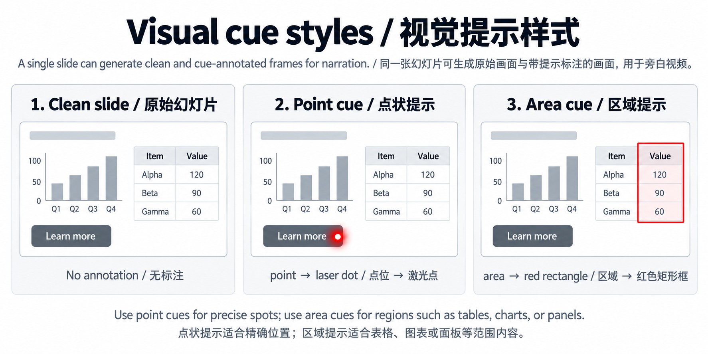

# Slides to Video：把幻灯片做成带旁白的视频

这个项目把 **PPTX 或 PDF** 转成 MP4 视频：先根据幻灯片画面编写旁白，再在需要的位置显示红点或红框提示。适合做产品演示、培训、课程讲解、报告回放和用户操作指南。

它不会简单地把页面文字逐句念出来。旁白会说明这一页想表达的重点、数字之间的关系，以及观众应该看哪里。

## 你会得到什么

- 1080p MP4（默认 1920×1080）。
- 与旁白同步的视觉提示：红点用于按钮、数据点等单个目标；红框用于表格列、图表或整块区域。
- 每段旁白单独合成并记录实际时长，画面和声音自动同步。
- 合成前先检查旁白、锚点和提示图；确认后才调用 TTS。
- 所有画面和音频只经过一次 ffmpeg 编码，减少翻页闪烁和时间戳问题。


## 安装

如果你通过 MiMoCode 使用本项目，直接发送：

```text
从这个 GitHub 仓库安装 slides-to-video 技能：
https://github.com/098765d/slides-to-video
```

手动运行脚本时，先安装 Python 依赖：

```bash
pip install -r requirements.txt
```

还需要安装 `ffmpeg` 和 `ffprobe`。

- **Windows**：PPTX 需要已安装 Microsoft PowerPoint；PDF 需要 Poppler。
- **Linux/macOS**：需要 LibreOffice（把 PPTX 转成 PDF）和 Poppler（把 PDF 转成 PNG）。

Ubuntu 示例：

```bash
sudo apt update
sudo apt install -y ffmpeg poppler-utils libreoffice
```

## 五步快速开始

下面假设输入文件叫 `deck.pptx`，所有中间文件放在 `build/`。

### 1. 把幻灯片渲染成 PNG

```bash
# Windows 使用 python；Linux/macOS 可使用 python3
python scripts/slides_to_png.py deck.pptx build/slides --width 1920
```

如果页面有密集表格或很小的字，可以把宽度改成 `2560`。

### 2. 写视觉锚点和旁白

复制 `examples/visual_notes.example.yaml` 和 `examples/narration_script.example.md`，分别保存为：

```text
build/visual_notes.yaml
build/narration_script.md
```

旁白用 `## Slide N` 分页，用 `[A]`、`[B]` 等标记切换提示画面。标记不会被读出来，例如：

```markdown
## Slide 2 — Results
**Say:**
[A] 左侧图表显示了结果中的主要趋势。

[B] 右上角卡片给出了最需要记住的数字。
```

### 3. 生成提示图并检查

```bash
python scripts/annotate_slides.py build/slides build/visual_notes.yaml build/cues \
  --script build/narration_script.md
```

打开并检查以下内容：

- `build/narration_script.md`：旁白是否准确、顺畅；
- `build/visual_notes.yaml`：每个 `[A]`、`[B]` 是否都有对应锚点；
- `build/cues/`：红点或红框是否覆盖了正确位置。

发现问题就修改这三个文件，再重新运行第 3 步。

提示样式和 cue 与音频的绑定方式如下：




### 4. 合成语音

默认使用免费的 `edge-tts`（需要联网，音色会按语言自动选择）：

```bash
python scripts/tts_narration.py build/narration_script.md build/audio
```

命令会生成分段 MP3 和 `build/audio/manifest.json`。也可以使用 OpenAI 兼容的 TTS 服务，详见[语音配置](#语音配置)。

### 5. 合成视频

```bash
python scripts/assemble_video.py build/slides build/audio output.mp4 \
  --cues-dir build/cues
```

最终视频保存在 `output.mp4`。脚本默认读取 `build/audio/manifest.json`。

## 视觉锚点怎么写

坐标都是 **0 到 1 的归一化值**，原点在左上角。点目标使用 `target: [x, y]`；区域目标使用 `shape: rectangle` 和 `box: [x, y, w, h]`，其中 `w`、`h` 是宽度和高度。

```yaml
slides:
  - slide: 8
    title: Model evaluation
    visuals:
      - id: A
        element: confusion matrix
        shape: rectangle
        box: [0.12, 0.30, 0.40, 0.42]
      - id: B
        element: missed detections card
        target: [0.62, 0.66]
```

每个 cue 必须有同名的 `id`。一个锚点对应一张提示图和一段音频；没有锚点的 cue 会在校验时报告错误。

## 语音配置

### edge-tts（默认）

```bash
python scripts/tts_narration.py build/narration_script.md build/audio \
  --provider edge --voice zh-CN-YunxiNeural
```

### OpenAI 兼容接口

不要把密钥写进脚本或提交到 Git。通过参数或环境变量传入：

```bash
export TTS_API_KEY="..."
export TTS_BASE_URL="https://host/v1"
export TTS_MODEL="tts-model"
python scripts/tts_narration.py build/narration_script.md build/audio \
  --provider openai --voice default
```

也可以显式传入 `--base-url`、`--api-key` 和 `--model`。

## 常见问题

**PPTX 无法渲染**：Windows 请确认 PowerPoint 已安装并能正常打开文件；Linux/macOS 请确认 LibreOffice 已安装。

**PDF 无法渲染**：确认 `pdftoppm` 可在终端直接运行（它由 Poppler 提供）。

**提示位置不对**：检查 `visual_notes.yaml` 中的归一化坐标；修改后重新运行 `annotate_slides.py`。

**旁白和画面不同步**：不要手动改音频文件名或 `manifest.json`；重新运行 TTS，再运行视频合成。

## 项目结构

```text
slides-to-video/
├── scripts/
│   ├── slides_to_png.py      # PPTX/PDF → PNG
│   ├── annotate_slides.py    # 锚点 → 红点/红框提示图
│   ├── tts_narration.py      # 旁白 → 分段音频和 manifest.json
│   ├── assemble_video.py     # PNG + 音频 → MP4
│   └── script_parser.py      # 旁白脚本解析
├── examples/                 # 可复制的 YAML 和 Markdown 示例
├── references/               # 旁白写作和设计说明
├── assets/                   # 流程图和提示样式图
├── requirements.txt
└── SKILL.md                  # MiMoCode 使用的完整流程
```

更详细的旁白写作规则见 [`references/script-guide.md`](references/script-guide.md)，设计原理见 [`references/architecture.md`](references/architecture.md)。
