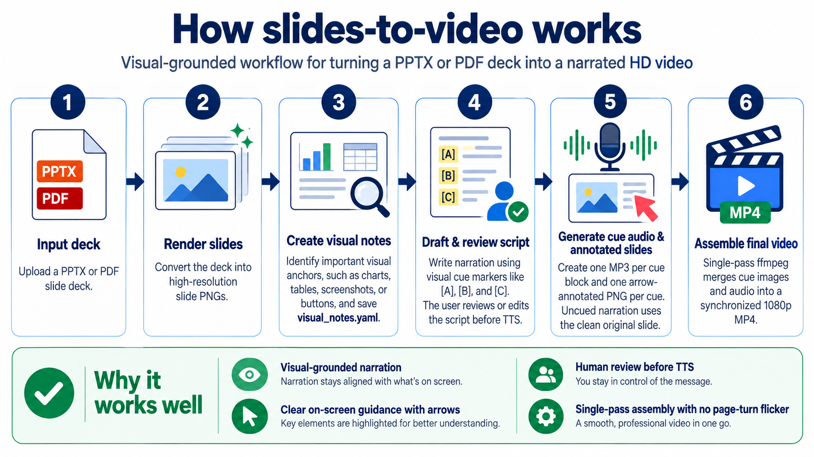
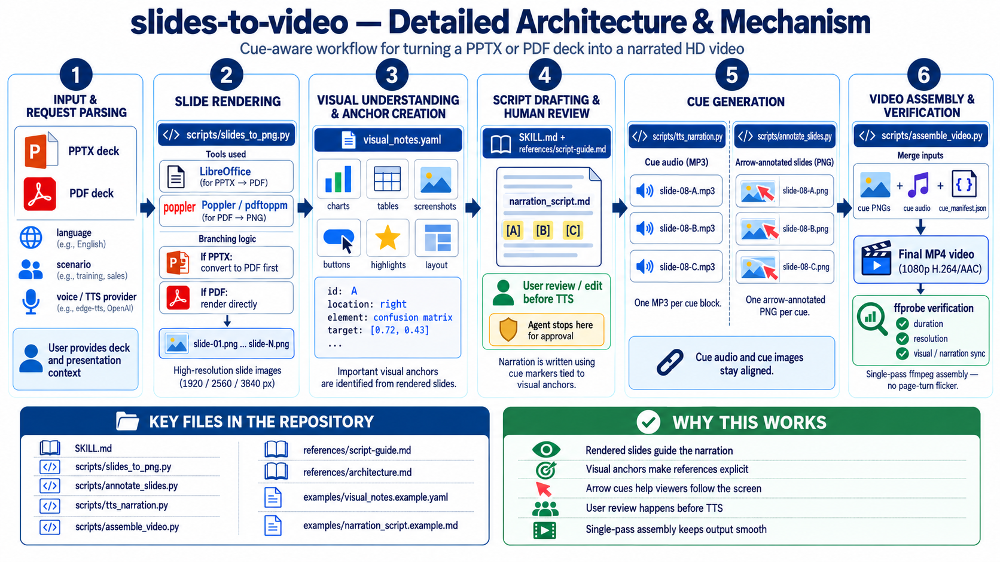

# slides-to-video — visual-grounded narration

Turn any PPTX/PDF deck into a narrated HD video with **visual-aware narration**, **optional arrow cues**, **human review before TTS**, and **single-pass ffmpeg assembly**.

<p align="center">
  
</p>

> **At a glance:** the deck is rendered to slide images, important visual anchors are identified, narration is tied to those anchors with cue markers such as `[A]` and `[B]`, arrow-annotated slide variants are generated, and cue-level audio is synchronized into one final MP4.

The core mechanism is intentionally simple:

```text
PPTX / PDF
    ↓
high-resolution slide PNGs
    ↓
visual anchors in visual_notes.yaml
    ↓
cue-aware narration [A] [B] [C]
    ↓
arrow-annotated PNGs + cue-level TTS
    ↓
single-pass ffmpeg assembly
    ↓
1080p MP4
```

This repository is designed to work across arbitrary slide decks. It does **not** require PowerPoint animations, GUI automation, mouse tracking, OCR, or word-level speech timing.

---

## Why visual grounding?

Slides communicate through more than text. Charts, tables, screenshots, diagrams, highlighted controls, and spatial relationships often carry the main message.

A weak pipeline may only paraphrase visible text. This skill instead inspects the rendered slide and can explicitly connect narration to a visual anchor. For example:

```markdown
[A] The chart on the left shows the main pattern in the result.
[B] The summary card in the upper-right gives the number to remember.
```

The cue markers are not spoken. They control which annotated slide image is shown while that narration block plays.

---

# Features

| Capability | What it does |
|---|---|
| Visual-aware narration | Rendered slides influence the explanation, not only extracted text |
| Visual anchors | Records important slide regions as semantic notes + normalized coordinates |
| Cue markers | Connects narration blocks to visual anchors with `[A]`, `[B]`, etc. |
| Arrow cue PNGs | Generates deterministic annotated slide variants |
| Human review gate | Script/visual notes can be checked before TTS |
| Free default TTS | Uses `edge-tts` |
| OpenAI-compatible TTS | Supports compatible `/audio/speech` endpoints |
| Audio-driven timing | Every cue duration follows measured TTS audio |
| Clean base narration | Sentences that do not need a pointer use the original slide |
| Single-pass assembly | Avoids segment-concat flicker and timestamp seams |
| HD output | 1920×1080 by default; source slides can be rendered at 2560/3840 px |

---

## Architecture & mechanism

For the full component-level workflow, see the detailed architecture below.

<p align="center">
  
</p>

The two diagrams serve different purposes:

- **`principle.png`** — quick first-view explanation of the workflow.
- **`design.png`** — detailed implementation view showing rendering, visual anchors, cue-aware script generation, TTS, annotated PNGs, assembly, and verification.

For a text-based architecture description, see [`references/architecture.md`](references/architecture.md).

---

# Requirements

Ubuntu/Debian system tools:

```bash
sudo apt update
sudo apt install -y ffmpeg poppler-utils libreoffice
```

Python:

```bash
pip install -r requirements.txt
```

`requirements.txt` includes:

- `edge-tts`
- `Pillow`
- `PyYAML`

---

# Repository structure

```text
slides-to-video/
├── .gitignore
├── README.md
├── SKILL.md
├── requirements.txt
├── scripts/
│   ├── slides_to_png.py
│   ├── annotate_slides.py
│   ├── tts_narration.py
│   └── assemble_video.py
├── references/
│   ├── script-guide.md
│   └── architecture.md
└── examples/
    ├── visual_notes.example.yaml
    └── narration_script.example.md
```

---

# Quick start

## 1. Rasterize the deck

```bash
python3 scripts/slides_to_png.py deck.pptx build/slides --width 1920
```

For dense slides:

```bash
python3 scripts/slides_to_png.py deck.pptx build/slides --width 2560
```

---

## 2. Create visual notes

Create `build/visual_notes.yaml`:

```yaml
slides:
  - slide: 2
    title: Results
    visuals:
      - id: A
        location: left
        element: main chart
        target: [0.28, 0.50]

      - id: B
        location: upper-right
        element: key result card
        target: [0.78, 0.32]
```

Coordinates are normalized from 0 to 1.

Optional arrow origin override:

```yaml
from: [0.62, 0.18]
```

---

## 3. Write the narration

Create `build/narration_script.md`:

```markdown
# Example Deck — Voiceover Script

## Slide 1 — Introduction
**Say:**
This slide introduces the purpose of the presentation.

## Slide 2 — Results
**Visuals:**
- [A] left — main chart
- [B] upper-right — key result card

**Say:**
[A] The chart on the left shows the main pattern in the result.

[B] The summary card in the upper-right gives the number to remember.
```

`[A]` and `[B]` are control markers and are never spoken.

Text without a cue marker uses the clean slide image.

See `references/script-guide.md` for narration guidance.

---

## 4. Validate cues and render arrow PNGs

```bash
python3 scripts/annotate_slides.py \
  build/slides \
  build/visual_notes.yaml \
  build/cues \
  --script build/narration_script.md
```

Example outputs:

```text
build/cues/slide-02-A.png
build/cues/slide-02-B.png
```

If the script references `[C]` but no C anchor exists for that slide, the command
fails before TTS.

---

## 5. Generate cue-level narration audio

### edge-tts

```bash
python3 scripts/tts_narration.py \
  build/narration_script.md \
  build/audio \
  --provider edge \
  --voice en-US-AndrewNeural
```

Outputs include:

```text
build/audio/slide-02-A-01.mp3
build/audio/slide-02-B-01.mp3
build/audio/manifest.json
```

### OpenAI-compatible TTS

Keep credentials in environment variables:

```bash
export TTS_API_KEY="..."
export TTS_BASE_URL="https://your-provider.example/v1"
export TTS_MODEL="your-tts-model"
```

Then:

```bash
python3 scripts/tts_narration.py \
  build/narration_script.md \
  build/audio \
  --provider openai \
  --voice default
```

Never commit API keys.

---

## 6. Assemble one final video

```bash
python3 scripts/assemble_video.py \
  build/slides \
  build/audio \
  output.mp4 \
  --cues-dir build/cues \
  --width 1920 \
  --height 1080 \
  --fps 15 \
  --crf 17 \
  --pad 1.0 \
  --cue-pad 0.10
```

`assemble_video.py` reads `build/audio/manifest.json` automatically.

The final MP4 is encoded in one ffmpeg filtergraph.

---

# How cue timing works

Suppose slide 8 contains:

```markdown
[A] First explanation.
[B] Second explanation.
[C] Third explanation.
```

TTS might produce:

```text
A = 5.4 s
B = 6.7 s
C = 4.2 s
```

The video then shows:

```text
slide-08-A.png while A audio plays
slide-08-B.png while B audio plays
slide-08-C.png while C audio plays
```

No speech recognition or word-level timestamping is required.

---

# Annotation style

`annotate_slides.py` uses one consistent arrow by default:

- high contrast;
- white halo for readability over screenshots/charts;
- no moving cursor;
- no PowerPoint animation;
- no unnecessary circles or decorative effects.

Change arrow colour if required:

```bash
python3 scripts/annotate_slides.py ... --color FF7A00
```

If an automatic arrow starts in a bad location, add `from: [x, y]` to that
anchor in `visual_notes.yaml`.

---

# Agent-skill usage

Place the repository in the agent's skills directory, for example:

```text
.agents/skills/slides-to-video/
```

Then ask:

> Turn this PPT into a narrated training video with visual pointers.

The agent should:

1. parse the request;
2. rasterize the deck;
3. inspect the rendered slides;
4. create visual anchor notes where pointers help;
5. write cue-aware narration;
6. generate/validate cue preview PNGs;
7. stop for user review;
8. synthesize approved cue-level narration;
9. assemble one video;
10. verify cue/voice synchronization and deliver.

The cue system remains selective. Not every slide needs arrows.

---

# Backward compatibility

`assemble_video.py` still supports the old per-slide format if no
`audio/manifest.json` exists and the audio directory contains:

```text
narr_01.mp3
narr_02.mp3
...
```

In that mode, it behaves like the original repository and uses clean slide PNGs.

---

# Troubleshooting

| Problem | Recommended action |
|---|---|
| Slide text looks soft | Render source slides at 2560/3840 px |
| Script cue has no anchor | Add/fix the anchor in `visual_notes.yaml` or remove the cue |
| Arrow points to wrong item | Correct normalized `target` |
| Arrow covers text | Add an explicit `from` coordinate |
| Narration says “on the right” incorrectly | Rewrite using only grounded visual notes |
| Narration sounds like slide reading | Reinspect the rendered slide and explain meaning/action instead |
| edge-tts fails | Retry, check network, or use a compatible TTS provider |
| Custom TTS returns 401 | Check runtime key; never save it in the repo |
| Video flickers | Confirm single-pass `assemble_video.py` is being used |
| Long encode times out | Run assembly in background and poll the log |

---

# Security

Never commit API keys.

Use runtime environment variables or CLI arguments only.

---

# License

MIT
