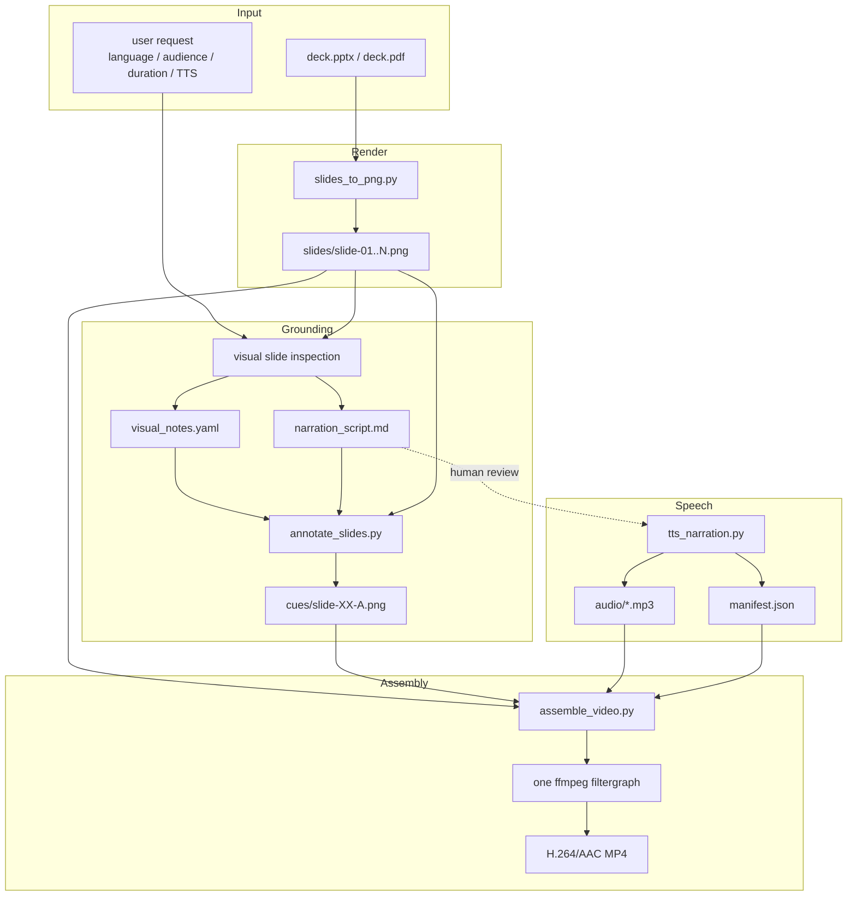

# Architecture — Visual-Grounded Slides-to-Video

## Why this design exists

The pipeline solves two different problems:

1. **Narration grounding** — the voice should refer to the correct chart, table,
   screenshot region, metric, or diagram element rather than producing generic
   slide summaries.
2. **Video stability** — the final video should remain synchronized and avoid
   flicker or black frames at cue/slide transitions.

The design deliberately uses a small visual-control layer instead of PowerPoint
animations or word-level speech alignment.

---

## End-to-end flow

```mermaid
flowchart LR
    A[User request + PPTX/PDF] --> B[slides_to_png.py]
    B --> C[High-resolution slide PNGs]
    C --> D[Visual inspection]
    D --> E[visual_notes.yaml\nanchors + normalized targets]
    D --> F[narration_script.md\n[A]/[B]/[C] cue markers]
    E --> G[annotate_slides.py]
    F --> G
    G --> H[Arrow-annotated cue PNGs]
    E --> I{Human review gate}
    F --> I
    H --> I
    I -- approved --> J[tts_narration.py]
    J --> K[Cue-level MP3s + manifest.json]
    C --> L[assemble_video.py]
    H --> L
    K --> L
    L --> M[One ffmpeg filtergraph]
    M --> N[1080p H.264/AAC MP4]
```

---

## Core data model

### Visual anchor

A visual anchor identifies one meaningful target on one slide:

```yaml
- id: B
  location: middle-right
  element: missed detections card
  target: [0.62, 0.66]
```

`target` uses normalized coordinates so the same anchor works at different
render resolutions.

### Narration cue

The narration uses the same anchor id:

```markdown
[B] The value to focus on is missed detections.
```

The cue marker is metadata; it is not spoken.

### Rendered cue frame

`annotate_slides.py` creates:

```text
slide-08-B.png
```

with one arrow pointing at the anchor target.

### Audio segment

`tts_narration.py` creates:

```text
slide-08-B-01.mp3
```

and writes its measured duration to `manifest.json`.

The result is a deterministic relationship:

```text
spoken cue block ↔ visual target ↔ annotated frame ↔ measured audio duration
```

---

## Five design principles

### 1. Rendered slides are reasoning input

The slide PNGs are used to understand layout, hierarchy, charts, tables,
screenshots, diagrams, and highlighted regions. Extracted text alone is not
sufficient.

### 2. Visual references are contractual, not decorative

When narration explicitly says “on the right”, “this chart”, “the last column”,
or similar, the reference should correspond to an anchor derived from the
rendered slide.

This prevents polished-sounding but incorrect spatial narration.

### 3. Cue-level audio is the master clock

Each cue block has its own measured TTS duration.

```text
cue frame duration = measured cue audio + small cue pad
```

The final cue on a slide receives the normal slide breathing pad.

No word-level timestamps are required.

### 4. Static annotated PNGs are more stable than presentation animations

Instead of replaying PowerPoint animations or simulating a mouse cursor, the
pipeline produces a small set of deterministic PNG variants:

```text
slide-08.png       clean
slide-08-A.png     arrow to A
slide-08-B.png     arrow to B
```

This works consistently for PPTX and PDF inputs.

### 5. The final video is encoded once

All cue frames and audio segments enter one ffmpeg filtergraph. The pipeline does
not create many MP4 fragments and concatenate them afterward.

This avoids timestamp discontinuities, keyframe mismatches, pixel-format seams,
and visible page-turn flicker.

---

## Component view



---

## Why not use PowerPoint animations?

They are difficult to reproduce consistently in headless Linux pipelines and
make PDF inputs impossible to treat equivalently.

Static cue PNGs are deterministic and renderer-independent.

## Why not use a moving mouse cursor?

Cursor motion adds unnecessary timing complexity and often distracts from the
content. A single arrow is enough to answer “where should I look?”

## Why not use word-level timestamps?

Word alignment can provide very precise animation, but it adds TTS-provider
coupling or forced-alignment dependencies. Cue-level segmentation gives most of
the comprehension benefit with much lower implementation risk.

## Why keep uncued narration?

Not every sentence needs a pointer. Title slides, conceptual summaries, and
transitions often work better with the clean slide. The cue system therefore
supports both grounded and uncued/base narration within the same slide.
