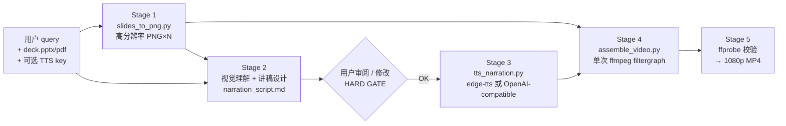
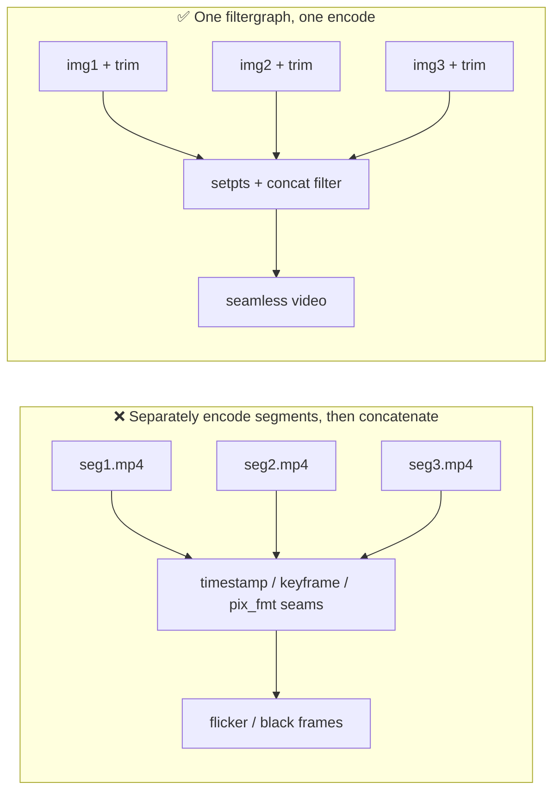

# Architecture — 原理图 & 设计图

## 原理图：why it works



## Four core principles

1. **讲稿即主时钟**  
   每页停留时长 = 该页 TTS 实测时长 + breathing pad，音画天然同步。

2. **单次编码消闪烁**  
   不把每页单独编码成 mp4 再拼接。所有页面在一个 ffmpeg filtergraph 中
   统一 `trim + setpts + concat` 后一次编码，避免页间时间戳、关键帧和
   pixel-format 接缝。

3. **渲染后的 slide 同时也是讲稿理解输入**  
   PNG 不只用于最后的视频画面。Stage 2 应观察图表、表格、截图、流程图、
   高亮区域、视觉层级和空间关系，以此决定一个真实讲者会怎样讲，而不是
   仅把抽取出的文本改写成语音。

4. **人类审阅门禁**  
   讲稿是纯 Markdown，在任何 TTS 调用前必须让用户审阅/修改。

## 设计图：components & data flow

```mermaid
flowchart TB
    subgraph Input
        Q[query 解析<br/>语言 / 场景 / 时长 / TTS]
        D[deck.pptx | deck.pdf]
    end

    subgraph Render
        S1[slides_to_png.py<br/>LibreOffice → PDF → pdftoppm]
        P[slides/slide-01..N.png]
    end

    subgraph Narration
        V[视觉理解<br/>slide purpose + hierarchy + evidence]
        M[narration_script.md<br/>★ 用户可编辑]
        S2[tts_narration.py<br/>edge | openai]
        U[audio/narr_01..N.mp3]
    end

    subgraph Assembly
        S3[assemble_video.py<br/>single-pass filtergraph]
        OUT[1080p H.264/AAC MP4]
    end

    D --> S1 --> P
    Q --> V
    P --> V --> M
    M -. 用户审阅门禁 .-> S2
    Q --> S2
    S2 --> U
    P & U --> S3 --> OUT
```

## Why the narration design stays flexible

The skill deliberately avoids style quotas such as:

- "mention at least one visual element per slide";
- "use a left/right reference on every content slide";
- "always use orient → point → interpret → takeaway";
- "describe every chart or table";
- "make every slide 20–40 seconds".

Those rules can make narration sound synthetic.

Instead, the system provides heuristics and asks the model to judge how a
knowledgeable presenter would use each slide in context.

## Design decisions

| Decision | Reason |
|---|---|
| Only 3 implementation scripts | each pipeline step remains independently testable |
| Rendered slide PNGs feed narration reasoning | prevents text-only slide summarisation |
| Narration is Markdown | user can edit with any text editor |
| `**Say:**` is the parser contract | reviewer notes can coexist without entering TTS |
| Human review before TTS | narration interpretation remains user-controllable |
| edge-tts default | free, multilingual, no API key |
| OpenAI-compatible custom TTS | portable across compatible providers |
| API keys only via env/CLI | avoids accidental persistence |
| Single-pass video assembly | avoids page-turn flicker |
| Missing audio → still slide | one TTS failure does not destroy the whole render |

## Flicker root cause


