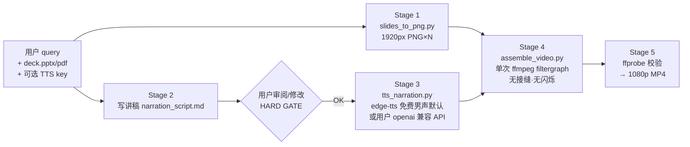
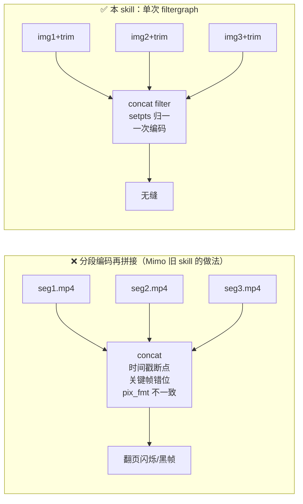

# Architecture — 原理图 & 设计图

## 原理图 (why it works)



核心原理三句话：

1. **讲稿即主时钟** — 每页停留时长 = 该页 TTS 实测时长 + 1.2s 呼吸间隔，音画天然同步。
2. **单次编码消闪烁** — 传统做法"每页先各自编码成小段 mp4 再 concat"会在段边界产生时间戳断点、关键帧错位和像素格式不一致，人眼看到的就是翻页闪烁/黑帧。本 skill 把所有页在一个 ffmpeg filtergraph 里 `trim+setpts` 对齐后一次编码，根本不存在接缝。
3. **人声即插即用** — 默认免费 edge-tts（男声起步，按场景选温柔/沉稳/活泼）；用户在 query 里给了 key 就切到其 OpenAI 兼容接口，key 只活在环境变量里，绝不落盘。

## 设计图 (components & data flow)

```mermaid
flowchart TB
    subgraph Input
        Q[query 解析\ndeck 路径 / 语言 / 场景 / key]
        D[deck.pptx | deck.pdf]
    end
    subgraph Scripts
        S1[slides_to_png.py\nLibreOffice→pdf→pdftoppm]
        S2[tts_narration.py\nprovider=edge|openai]
        S3[assemble_video.py\n单 pass filtergraph]
    end
    subgraph Artifacts["$BUILD/ 产物"]
        P[slides/slide-01..N.png]
        M[narration_script.md\n★ 用户可编辑]
        U[audio/narr_01..N.mp3]
        V[最终 1080p H.264/AAC mp4]
    end
    Q --> S1 & S2
    D --> S1 --> P
    M --> S2 --> U
    P & U --> S3 --> V
    M -. 用户审阅门禁 .-> S2
```

设计取舍（最简化，无冗余）：

| 决策 | 理由 |
|---|---|
| 只有 3 个脚本 | 每步一个可独立测试的命令；失败定位 = 看哪个脚本报错 |
| 讲稿是纯 markdown | 用户用任何编辑器都能改；TTS 解析只认 `## Slide N` + `**Say:**` |
| edge-tts 默认 | 免费、无需 key、多语言男/女声全；不绑定任何平台 |
| OpenAI 兼容自定义 TTS | Grok/Mimo/Codex/自建 都用同一套 `POST /audio/speech` 协议 |
| key 只在 env/CLI | 聊天里贴过的 key 视为半泄露，绝不再写入文件扩大暴露面 |
| 长视频 nohup 后台 + poll | 慢 CPU 上 18 页 1080p 编码超过单次工具调用时限 |
| 缺音频页 → 静帧 4s | 一段 TTS 失败不该毁掉整条视频 |

## 闪烁根因（对比）


